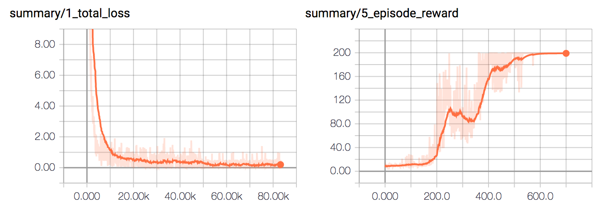

# dqn

implementation of Playing Atari with Deep Reinforcement Learning, Google DeepMind, 2012 (arxiv:1312.5602v1)

run main.py to replicate results, edit params.py if you want - works with any discrete gym env (200 max score)

700 training episodes (with e-greedy sampled actions) on the cartpole problem from OpenAI gym

